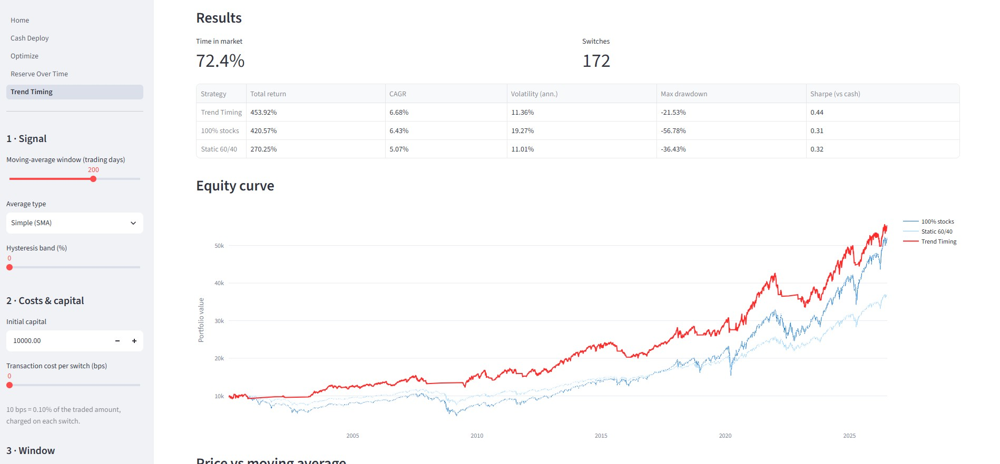

# Portfolio Research Lab

A local-first tool for backtesting investing strategies on historical price
data. Built with Python and Streamlit; runs entirely on your machine, with no
accounts, database or cloud services.

<p align="center">
  
</p>

## Features

- **Allocation backtest.** Split capital across assets (for example S&P 500 and a
  cash account earning the fed funds rate) and either hold or rebalance monthly,
  quarterly or annually.
- **Tactical cash deployment.** Hold a cash reserve, deploy it into stocks in
  tranches as the market falls from its highs, and drip it back to target once
  the market recovers. Compared against buy-and-hold and a static split.
- **Trend timing.** Hold stocks above a moving average (simple or exponential)
  and move to cash below it, with a hysteresis band, an optional per-switch
  transaction cost, and a one-bar signal lag to avoid look-ahead.
- **Parameter optimization.** A Bayesian search (Optuna) over the cash-deploy
  parameters, using walk-forward validation so the reported result is
  out-of-sample rather than curve-fit.
- **Metrics and charts.** Total return, CAGR, annualised volatility, max drawdown
  and Sharpe, with interactive equity-curve and drawdown charts shown against a
  benchmark.

## Quickstart

```bash
uv run poe setup      # install deps and fetch the bundled market data
uv run poe dev        # run the Streamlit app
```

`poe setup` runs `uv sync --extra dev` and then downloads the two data files the
app ships with (see below). Re-run `uv run poe refresh-data` any time to pull the
latest observations.

The app opens on the allocation backtester; the **Cash Deploy**, **Optimizer**
and **Trend Timing** pages are in the sidebar.

The **Upload CSV** option also works without any local files, if you'd rather
bring your own data.

## Bring your own data

<details>
<summary>CSV format</summary>

A `date` column and one closing-price column per asset:

```csv
date,STOCKS,BONDS,GOLD
2019-01-02,100.0,100.0,100.0
2019-01-03,100.8,100.1,99.4
```

Uploads are validated and size-bounded (10 MiB / 200k rows / 100 columns) before
anything is processed.

</details>

<details>
<summary>The bundled datasets (and why they're not in the repo)</summary>

The **Stocks + Cash (1954+)** and **S&P 500 (daily)** data sources are git-ignored,
so a fresh clone won't have them. `uv run poe setup` (or `uv run poe refresh-data`)
fetches `sp500daily.csv` and `fed-funds-rate.csv` into `data/`.

A note on **"Cash (Fed Funds)"**: the federal funds rate is a short-term overnight
rate. Compounding it models a risk-free cash / money-market account, _not_
long-term bonds. There's no duration or price risk in it.

</details>

## Using the engine directly

<details>
<summary>Drive it from a script or notebook</summary>

The simulation engine (`src/portfolio_research_lab/`) never imports Streamlit, so
you can use it anywhere:

```python
from portfolio_research_lab import (
    StrategyConfig,
    load_price_data,
    load_rate_series,
    rate_to_index,
    run_simulation,
)

stocks = load_price_data("data/sp500daily.csv").rename(columns={"close": "S&P 500"})
cash = rate_to_index(load_rate_series("data/fed-funds-rate.csv")).rename("Cash (Fed Funds)")
prices = stocks.join(cash, how="left").ffill().dropna(how="any")  # trims to 1954+

config = StrategyConfig(
    name="60/40, rebalanced annually",
    initial_capital=10_000,
    allocations={"S&P 500": 0.6, "Cash (Fed Funds)": 0.4},
    rebalance_frequency="annually",  # None = buy & hold
)
result = run_simulation(prices, config)
print(result.metrics())
```

</details>

## Development

<details>
<summary>Tasks, tests and project layout</summary>

Common tasks are [poe](https://poethepoet.natn.io/) tasks; run `uv run poe` to
list them.

```bash
uv run poe test        # run the test suite
uv run poe cov         # tests + coverage
uv run poe lint        # lint (ruff)
uv run poe format      # format (ruff)
uv run poe typecheck   # type-check (ty)
uv run poe check       # lint + typecheck + test
```

The same gates run in CI on every push and pull request.

</details>

<details>
<summary>Running it on the public internet</summary>

This tool is built to run locally. Before exposing it to arbitrary users:

- Keep the in-code upload limits and the `maxUploadSize` cap in `.streamlit/config.toml`.
- Put it behind authentication and/or a reverse proxy with rate limiting.
- Set CPU/memory limits on the container or host.
- Don't commit market data you aren't licensed to redistribute.
</details>

## Project structure

The engine is a plain Python package with no Streamlit dependency; the app is a
thin presentation layer on top of it.

```
app/
  Home.py                    # allocation backtester (UI only)
  pages/
    1_Cash_Deploy.py         # tactical cash-deployment page
    2_Optimize.py            # Bayesian parameter search
    3_Reserve_Over_Time.py   # how the best cash reserve drifts through history
    3_Trend_Timing.py        # moving-average trend timing
src/portfolio_research_lab/
  models.py                  # Pydantic config models
  data.py                    # CSV / rate loading + cleaning
  strategies.py              # strategy definitions (buy-and-hold)
  simulator.py               # fixed-weight portfolio engine
  cash_deploy.py             # tactical cash-deployment engine
  timing.py                  # moving-average trend-timing engine
  optimizer.py               # Optuna search + walk-forward validation
  metrics.py                 # returns, CAGR, volatility, drawdown
tests/                       # pytest unit tests
```

## Scope

Kept deliberately small and readable: no databases, accounts, cloud or ML. Taxes
and leverage aren't modelled, and transaction costs only where a strategy trades
on a signal (the trend-timing per-switch cost). The other engines assume
frictionless rebalancing.

---

_For research and education only. This is not financial advice and not a
recommendation to buy or sell anything. Do your own research._

License: MIT
